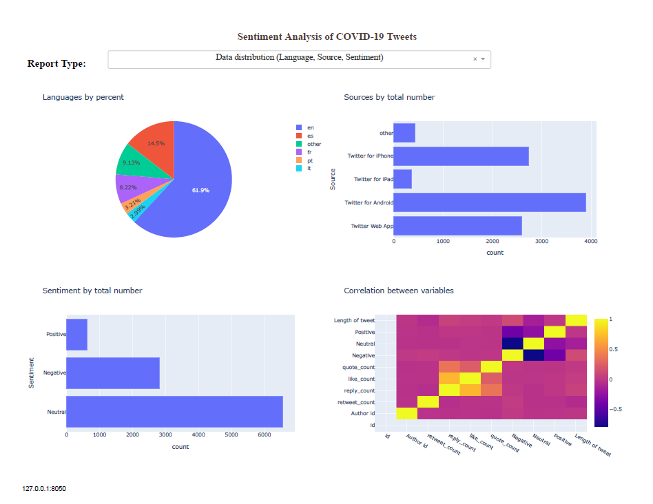
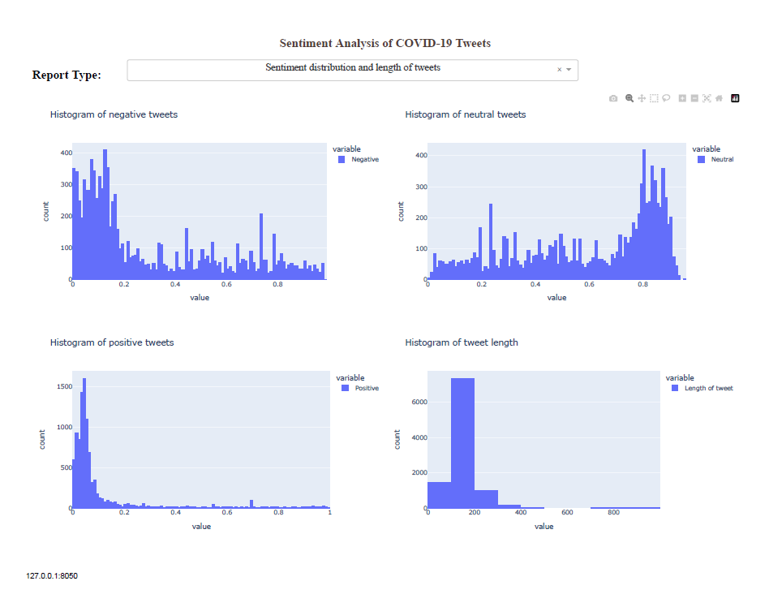

# Twitter_Project

The objective of this project is to collect the 10000 most recent tweets about a topic, then create a sentiment analysis of the tweets, and finally create a dash board to show the results in a graphical form.

## Part 1. Running the Project.py file
Before running the Project.py file. One must get credentials from Twitter and fill out the required variables in the file config.py.
Then change the topic on line 22 by reqritting the argument after client.search_recent_tweets. In the file, the argument is set as covid.
After the file is run, a csv file name twetts.csv will be generated. A file is already given in the repository in case one wants to skip this step.

## Part 2. Running the Analysis.py file
After running this file, some graphs and general statistics will be generated. It will also create a file name tweets2.csv with the sentiment analysis of each tweet.

## Part 3. Running the DashBoard.py file
Running this file will generate the dash board shown below with interactive graphs similar to those generated by the Analysis.py file.

